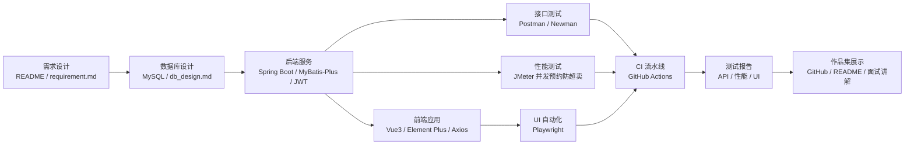

# QueueMate

QueueMate 是一个面向测开作品集的生活排队与预约平台项目。它用奶茶店、自习室、羽毛球场等模拟生活场景，练习 Spring Boot + Vue3 + MySQL 的完整开发流程，并重点展示接口测试、权限测试、并发测试、Web UI 自动化测试和 GitHub Actions CI 能力。

当前已完成项目初始化、设计文档、MySQL 初始化、用户认证、地点管理与 RBAC，以及固定预约时段的公开查询、创建和状态管理。后续继续实现并发预约、钱包、排队、前端和 CI。

## 当前进度

- Spring Boot 后端可连接本地 MySQL 并正常启动
- 已实现 `POST /api/v1/auth/register`
- 已实现 `POST /api/v1/auth/login`
- 已实现 `GET /api/v1/auth/me`
- 已实现 BCrypt 密码哈希、JWT Bearer 鉴权、统一 401/403 响应
- 已实现地点列表、详情、创建、修改和启停接口
- 已实现 `USER`、`MERCHANT`、`ADMIN` 地点权限和商家资源隔离
- 已实现固定预约时段查询、创建和 `OPEN/CLOSED` 状态切换
- 已实现时段日期、时间、容量、价格、地点状态和重复时段校验
- 已有 47 个后端自动化测试
- 已提供 Postman 本地环境、认证、地点和时段测试集合

本地模拟账号：

| 角色 | 用户名 | 密码 |
| --- | --- | --- |
| ADMIN | `admin` | `Admin123456` |
| MERCHANT | `merchant_tea`、`merchant_sport` | `Merchant123456` |
| USER | `alice`、`bob`、`carol` | `User123456` |

这些账号仅用于本地测试，不应复制到真实环境。

## 项目目标

- 练习 Spring Boot + Vue3 + MySQL 的完整业务开发流程
- 体现测开价值，而不是只做基础 CRUD
- 为 Postman、JMeter、Playwright、GitHub Actions 提供可落地的测试对象
- 沉淀一个适合面试展示和后续扩展的个人作品集项目

## 技术栈

- 后端：Java, Spring Boot, MyBatis-Plus, MySQL
- 前端：Vue3, Element Plus, Axios
- 测试：Postman, JMeter, Playwright
- CI：GitHub Actions

## MVP 功能

- 用户注册、登录、JWT 鉴权
- 角色权限：`USER`、`MERCHANT`、`ADMIN`
- 地点管理：奶茶店、自习室、羽毛球场等模拟地点
- 时间段预约：固定时段槽位、容量限制、取消预约、重复预约限制
- 模拟余额支付：站内钱包、模拟充值、预约扣款、取消退款、支付流水
- 现场取号：取号、叫号、完成、过号
- 繁忙时段统计

## 项目生态链

QueueMate 的完整作品集生态链是：

```text
需求设计 -> 数据库设计 -> 后端 API -> 前端页面 -> 接口测试
       -> 性能测试 -> UI 自动化 -> CI 自动执行 -> 测试报告 -> 作品集展示
```



完整生态链说明见：[docs/ecosystem.md](docs/ecosystem.md)

## 非目标

- 不接真实地图
- 不接短信验证码
- 不接微信登录
- 不接真实支付平台，例如微信支付、支付宝、银行卡
- 不接真实商家或真实地理位置数据

## 仓库结构

```text
QueueMate/
|-- README.md
|-- docs/
|   |-- api_design.md
|   |-- db_design.md
|   |-- ecosystem.md
|   |-- requirement.md
|   `-- test_plan.md
|-- knowledge/
|   |-- 01-project-initialization-and-runtime.md
|   |-- 02-authentication-and-jwt.md
|   |-- 03-venue-management-and-rbac.md
|   `-- 04-booking-slots.md
|-- backend/
|   `-- queuemate-server/
|       `-- src/
|           |-- main/
|           |   |-- java/
|           |   `-- resources/
|           `-- test/
|               `-- java/
|-- frontend/
|   `-- queuemate-web/
|       |-- public/
|       `-- src/
|-- tests/
|   |-- jmeter/
|   |-- playwright/
|   |   `-- specs/
|   `-- postman/
|-- .github/
|   `-- workflows/
|-- scripts/
`-- sql/
```

## 文档说明

- 需求说明：[docs/requirement.md](docs/requirement.md)
- 数据库设计：[docs/db_design.md](docs/db_design.md)
- 接口设计：[docs/api_design.md](docs/api_design.md)
- 测试计划：[docs/test_plan.md](docs/test_plan.md)
- 生态链说明：[docs/ecosystem.md](docs/ecosystem.md)
- 本地开发环境：[docs/dev_setup.md](docs/dev_setup.md)
- 初始化学习记录：[knowledge/01-project-initialization-and-runtime.md](knowledge/01-project-initialization-and-runtime.md)
- 认证学习记录：[knowledge/02-authentication-and-jwt.md](knowledge/02-authentication-and-jwt.md)
- 地点与 RBAC 学习记录：[knowledge/03-venue-management-and-rbac.md](knowledge/03-venue-management-and-rbac.md)
- 固定预约时段学习记录：[knowledge/04-booking-slots.md](knowledge/04-booking-slots.md)

## 开发规划

### Phase 1

- 完成项目初始化和文档设计
- 确定仓库结构、数据库模型、核心接口和测试策略

### Phase 2

- 实现 Spring Boot 后端基础框架
- 完成认证、权限、地点、预约、排队核心 API
- 预留集成测试和并发测试入口

### Phase 3

- 实现 Vue3 前端基础页面
- 打通登录、地点浏览、预约、我的预约、商家叫号等主流程

### Phase 4

- 接入 Postman/Newman 接口测试
- 接入 JMeter 并发预约性能测试
- 接入 Playwright Web UI 自动化测试

### Phase 5

- 接入 GitHub Actions 持续集成
- 自动执行构建、基础测试和关键回归

## 测开亮点

- JWT 鉴权与 RBAC 权限测试
- 预约并发场景下的防超卖验证
- 余额支付场景下的防重复扣款、余额不足和退款一致性验证
- 预约与取号状态流转校验
- 商家隔离与越权访问测试
- Web UI 自动化覆盖用户端和商家端主流程

## 后续实现建议

- 后端先落认证、地点、预约三条主线，再接入模拟余额支付
- 数据库先落核心表和初始化模拟数据
- 前端先做最短业务闭环，不追求复杂设计
- 自动化测试优先覆盖接口、权限、并发、支付一致性和状态流转
