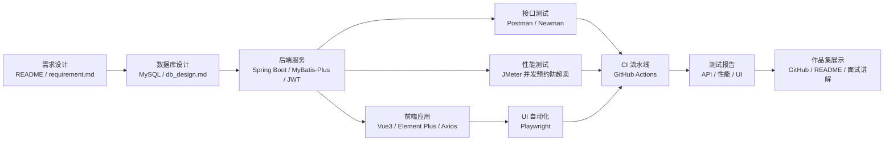

# QueueMate

QueueMate 是一个面向测开作品集的生活排队与预约平台项目。它用奶茶店、自习室、羽毛球场等模拟生活场景，练习 Spring Boot + Vue3 + MySQL 的完整开发流程，并重点展示接口测试、权限测试、并发测试、Web UI 自动化测试和 GitHub Actions CI 能力。

当前已完成项目初始化、设计文档、MySQL 初始化、需求范围内的全部后端功能、Vue3 全角色前端业务闭环，以及管理员余额调整、商家入驻审核、付费预约退款、消费码核销、排队完成和排队过号六条可重复执行的 Playwright 链路。后续继续扩充测试覆盖并接入 CI。

## 当前进度

- Spring Boot 后端可连接本地 MySQL 并正常启动
- 已实现 `POST /api/v1/auth/register`
- 已实现 `POST /api/v1/auth/login`
- 已实现 `GET /api/v1/auth/me`
- 已实现 BCrypt 密码哈希、JWT Bearer 鉴权、统一 401/403 响应
- 已实现地点列表、详情、创建、修改和启停接口
- “发现地点”使用后端分页，每页展示 9 家，并通过 URL 保留筛选条件和页码
- 已实现 `USER`、`MERCHANT`、`ADMIN` 地点权限和商家资源隔离
- 已实现普通用户商家入驻申请、管理员审核、驳回原因与重新申请
- 已实现同一账号保留顾客与商家身份，并可在前端切换工作区
- 已实现固定预约时段查询、创建和 `OPEN/CLOSED` 状态切换
- 已实现时段日期、时间、容量、价格、地点状态和重复时段校验
- 已实现免费预约创建、我的预约查询、取消预约、有效重复预约限制、取消名额回补和取消后重新预约
- 已通过数据库条件更新和事务保证并发预约不超卖
- 已实现钱包查询、模拟充值和钱包流水
- 已实现预约余额不足时前往充值，并在充值成功后返回原预约页面
- 已实现预付消费金额、收费预约扣款、消费码生成与商家核销
- 已实现未核销收费预约取消退款和消费码作废
- 已实现消费码定时过期并将预约转为 `NO_SHOW`
- 已通过钱包行锁、数据库唯一键和消费凭证行锁保证并发一致性
- 已实现管理员钱包流水查询和正负余额调整
- 已实现现场取号、本人号码、公开进度、叫号、完成和过号
- 已通过每日序列表和唯一约束保证并发取号号码连续且不重复
- 已实现预约与排队按小时聚合的地点繁忙统计
- 已有 144 个后端自动化测试
- 已提供覆盖全部后端模块的 45 请求 Postman 集合，包含按运行标记清理测试数据的收尾请求
- Newman 6.2.2 已完成真实 Spring Boot + MySQL 全量回归：45 个请求、99 个断言、0 失败，清理后本轮标记数据剩余 0
- JMeter 5.6.3 已完成 12 用户并发预约正式回归：容量 3 的时段得到 3 个成功和 9 个 `BOOKING_SLOT_FULL`，预约请求平均 191.1ms、P90 209ms、最大 215ms，56 个总采样 0 错误且清理后剩余 0
- Playwright 已完成 6 条真实浏览器回归：管理员余额调整、商家入驻审核、付费预约取消退款、商家核销消费码，以及用户取号后商家叫号并完成/过号；每轮测试后 `remainingArtifacts=0`
- 已初始化 Vue3 + Vite + Element Plus + Axios 前端
- 已实现注册、登录、地点浏览、预约、钱包、消费码、现场排队和历史记录页面
- 已实现商家/管理员地点维护、时段管理、叫号、核销和繁忙统计工作台
- 已实现管理员全局钱包流水、余额调整和预约取消页面
- 已实现 JWT 本地会话、多身份切换、角色导航、路由守卫、统一 API 错误处理和响应式布局
- 已建立 [design-system/MASTER.md](design-system/MASTER.md) 作为前端视觉与交互规范
- 前端生产构建已通过，15 个多角色页面/尺寸组合完成真实浏览器 QA，横向溢出和运行时错误均为 0

本地模拟账号：

| 角色 | 用户名 | 密码 |
| --- | --- | --- |
| ADMIN | `admin` | `Admin123456` |
| MERCHANT | `merchant_tea`、`merchant_sport` | `Merchant123456` |
| USER | `alice`、`bob`、`carol` | `User123456` |

这些账号仅用于本地测试，不应复制到真实环境。

本地演示数据包含 82 个模拟地点。在原有 12 个地点基础上，奶茶店、自习室、羽毛球场、饭店、酒店、妆造店和商场 7 个分类各新增 10 家内容完整的演示店铺；其中包含纯排队、纯预约、排队与预约并用以及停用维护中的不同状态。全新初始化直接执行 `sql/data.sql`，已有本地数据库依次执行 `sql/migrations/20260720_expand_demo_venues.sql` 和 `sql/migrations/20260725_add_category_demo_venues.sql` 增量补充。

已有本地数据库还需要执行 `sql/migrations/20260720_merchant_onboarding.sql`，以创建多身份和商家入驻申请表。普通用户登录后从顶部“商家入驻”进入申请页；管理员从“入驻审核”处理申请。

## 项目目标

- 练习 Spring Boot + Vue3 + MySQL 的完整业务开发流程
- 体现测开价值，而不是只做基础 CRUD
- 为 Postman、JMeter、Playwright、GitHub Actions 提供可落地的测试对象
- 沉淀一个适合面试展示和后续扩展的个人作品集项目

## 技术栈

- 后端：Java, Spring Boot, MyBatis-Plus, MySQL
- 前端：Vue3, Element Plus, Axios
- 测试：Postman, JMeter, Playwright
- CI：GitHub Actions

## MVP 功能

- 用户注册、登录、JWT 鉴权
- 角色权限：`USER`、`MERCHANT`、`ADMIN`
- 商家入驻：用户申请、管理员审核、驳回后重提、顾客/商家身份切换
- 地点管理：奶茶店、自习室、羽毛球场、饭店、酒店、妆造店、商场等模拟地点
- 时间段预约：固定时段槽位、容量限制、取消预约、有效重复预约限制、取消后重新预约
- 模拟余额支付：站内钱包、预付消费金额、预约扣款、取消退款、支付流水
- 预约消费码：付费预约生成消费凭证，用户出示、商家核销，核销后完成预约
- 现场取号：取号、叫号、完成、过号
- 繁忙时段统计

## 项目生态链

QueueMate 的完整作品集生态链是：

```text
需求设计 -> 数据库设计 -> 后端 API -> 前端页面 -> 接口测试
       -> 性能测试 -> UI 自动化 -> CI 自动执行 -> 测试报告 -> 作品集展示
```


```mermaid
flowchart LR
    A["需求设计<br/>README / requirement.md"] --> B["数据库设计<br/>MySQL / db_design.md"]
    B --> C["后端服务<br/>Spring Boot / MyBatis-Plus / JWT"]
    C --> D["前端应用<br/>Vue3 / Element Plus / Axios"]
    C --> E["接口测试<br/>Postman / Newman"]
    C --> F["性能测试<br/>JMeter 并发预约防超卖"]
    D --> G["UI 自动化<br/>Playwright"]
    E --> H["CI 流水线<br/>GitHub Actions"]
    F --> H
    G --> H
    H --> I["测试报告<br/>API / 性能 / UI"]
    I --> J["作品集展示<br/>GitHub / README / 面试讲解"]
```

完整生态链说明见：[docs/ecosystem.md](docs/ecosystem.md)

## 非目标

- 不接真实地图
- 不接短信验证码
- 不接微信登录
- 不接真实支付平台，例如微信支付、支付宝、银行卡
- 不接真实商家或真实地理位置数据

## 仓库结构

```text
QueueMate/
|-- README.md
|-- design-system/
|   `-- MASTER.md
|-- docs/
|   |-- api_design.md
|   |-- db_design.md
|   |-- ecosystem.md
|   |-- requirement.md
|   `-- test_plan.md
|-- knowledge/
|   |-- 01-project-initialization-and-runtime.md
|   |-- 02-authentication-and-jwt.md
|   |-- 03-venue-management-and-rbac.md
|   |-- 04-booking-slots.md
|   |-- 05-booking-concurrency.md
|   |-- 06-paid-booking-consumption-voucher-design.md
|   |-- 07-wallet-voucher-implementation.md
|   |-- 08-backend-completion.md
|   |-- 09-vue3-frontend-design-system.md
|   `-- 10-vue3-full-role-frontend.md
|-- backend/
|   `-- queuemate-server/
|       `-- src/
|           |-- main/
|           |   |-- java/
|           |   `-- resources/
|           `-- test/
|               `-- java/
|-- frontend/
|   `-- queuemate-web/
|       |-- public/
|       `-- src/
|-- tests/
|   |-- jmeter/
|   |-- playwright/
|   |   `-- specs/
|   `-- postman/
|-- .github/
|   `-- workflows/
|-- scripts/
`-- sql/
```

## Postman 本地全量回归

Postman 全量集合会创建用户、钱包流水、地点、时段、预约、消费码和排队号码。运行前必须使用 VS Code 的 `QueueMate Server (E2E - Postman cleanup enabled)` 启动项；普通启动默认不注册测试清理端点。

1. 导入 `tests/postman/QueueMate.postman_collection.json` 和 `tests/postman/QueueMate.local.postman_environment.json`。
2. 选择 `QueueMate Local` 环境。
3. 在 Runner 中选择全部请求，保持 1 次迭代，并取消 `Stop run if an error occurs`，保证发生断言失败时仍会执行最后的清理请求。
4. 确认 `Test Support Teardown / Cleanup current Postman run` 位于运行序列最后且已勾选。
5. 运行后检查断言汇总和清理响应；清理请求会删除本轮动态用户及其关联数据、测试地点、测试时段、排队号码和带运行标记的管理员调整流水。

测试清理端点同时受 `e2e` profile、`TEST_SUPPORT_ENABLED=true` 和 `ADMIN` 鉴权三重限制，默认及普通本地启动均不可用。若运行被手工中止，可在服务恢复后保留当前变量，单独执行管理员登录和清理请求。

命令行回归使用 Newman：

```powershell
cd D:\QueueMate\tests\postman
pnpm install
pnpm test:report
```

命令不会使用 `--bail`，以确保中间出现失败时仍能运行最后的清理请求。JSON 报告生成在 `tests/postman/newman-report.json`，该运行产物已加入 Git 忽略规则。

## JMeter 并发预约回归

JMeter 同样要求后端使用 E2E 启动项。测试计划会创建容量为 3 的独立免费时段和 12 个动态用户，通过同步定时器同时提交预约，断言只有 3 个成功、其余 9 个返回 `BOOKING_SLOT_FULL`，并校验时段已预约数为 3、剩余容量为 0。

```powershell
cd D:\QueueMate\tests\jmeter
.\run.ps1
```

脚本会自动生成唯一运行标记、JTL 结果和 HTML 报告，并在 tearDown 线程组中删除 12 个用户、预约、测试时段和测试地点。任何采样器或清理断言失败都会使一键脚本返回失败。

## Playwright 本地端到端回归

Playwright 同样要求后端使用 E2E 启动项。测试会通过 API 创建本轮独立地点和所需时段，通过真实浏览器完成管理员余额调整、商家入驻审核、注册、充值、预约退款、消费码核销，以及用户取号、商家叫号、完成/过号断言，并在 `finally` 中调用受保护的清理端点。

```powershell
cd D:\QueueMate\tests\playwright
pnpm install
pnpm exec playwright install chromium
pnpm test
```

当前用例位于 `tests/playwright/specs/admin-wallet-adjustment.spec.js`、`tests/playwright/specs/merchant-onboarding.spec.js`、`tests/playwright/specs/paid-booking-refund.spec.js`、`tests/playwright/specs/voucher-redeem.spec.js` 和 `tests/playwright/specs/queue-operator-flow.spec.js`。通过标准包括浏览器业务断言全部成功，以及每轮清理响应 `remainingArtifacts=0`；HTML 报告、截图、视频和 trace 均为忽略的本地运行产物。

## 文档说明

- 需求说明：[docs/requirement.md](docs/requirement.md)
- 数据库设计：[docs/db_design.md](docs/db_design.md)
- 接口设计：[docs/api_design.md](docs/api_design.md)
- 测试计划：[docs/test_plan.md](docs/test_plan.md)
- 生态链说明：[docs/ecosystem.md](docs/ecosystem.md)
- 本地开发环境：[docs/dev_setup.md](docs/dev_setup.md)
- 初始化学习记录：[knowledge/01-project-initialization-and-runtime.md](knowledge/01-project-initialization-and-runtime.md)
- 认证学习记录：[knowledge/02-authentication-and-jwt.md](knowledge/02-authentication-and-jwt.md)
- 地点与 RBAC 学习记录：[knowledge/03-venue-management-and-rbac.md](knowledge/03-venue-management-and-rbac.md)
- 固定预约时段学习记录：[knowledge/04-booking-slots.md](knowledge/04-booking-slots.md)
- 并发预约学习记录：[knowledge/05-booking-concurrency.md](knowledge/05-booking-concurrency.md)
- 付费预约与消费码设计：[knowledge/06-paid-booking-consumption-voucher-design.md](knowledge/06-paid-booking-consumption-voucher-design.md)
- 钱包与消费码实现记录：[knowledge/07-wallet-voucher-implementation.md](knowledge/07-wallet-voucher-implementation.md)
- 后端收官实现记录：[knowledge/08-backend-completion.md](knowledge/08-backend-completion.md)
- Vue3 前端与设计系统记录：[knowledge/09-vue3-frontend-design-system.md](knowledge/09-vue3-frontend-design-system.md)
- Vue3 全角色前端完成记录：[knowledge/10-vue3-full-role-frontend.md](knowledge/10-vue3-full-role-frontend.md)

## 开发规划

### Phase 1

- 完成项目初始化和文档设计
- 确定仓库结构、数据库模型、核心接口和测试策略

### Phase 2

- 实现 Spring Boot 后端基础框架
- 完成认证、权限、地点、预约、排队核心 API
- 预留集成测试和并发测试入口

### Phase 3

- 已完成 Vue3 访客、用户、商家、管理员页面和统一设计系统
- 已打通注册、地点浏览、预约、钱包、消费码、取号、场所运营和管理员工具页面代码
- 已完成真实后端只读联调和 15 个多角色、多尺寸浏览器检查

### Phase 4

- 已接入 Postman/Newman 接口测试
- 已接入 JMeter 并发预约性能测试
- 已接入 Playwright Web UI 自动化测试

### Phase 5

- 接入 GitHub Actions 持续集成
- 自动执行构建、基础测试和关键回归

## 测开亮点

- JWT 鉴权与 RBAC 权限测试
- 预约并发场景下的防超卖验证
- 余额支付场景下的防重复扣款、余额不足和退款一致性验证
- 预约与取号状态流转校验
- 商家隔离与越权访问测试
- Web UI 自动化覆盖用户端和商家端主流程

## 后续实现建议

- 需求范围内后端、Vue3 全角色前端和 6 条 Playwright 管理员/入驻/预约/核销/排队主链路已经完成
- Postman/Newman、JMeter 和 Playwright 正式回归均已完成并具备自动清理能力
- 建立 GitHub Actions 后端、前端、接口和 UI 测试流水线
