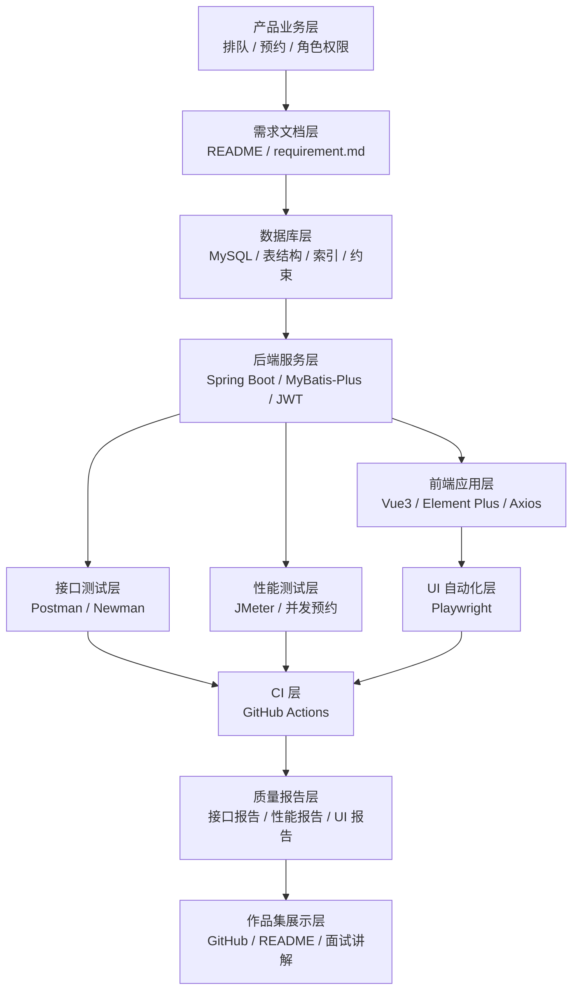

# QueueMate 项目生态链

QueueMate 不只是一个 Web CRUD 项目，而是一个围绕“生活排队与预约”场景搭建的测开作品集。它的生态链覆盖需求、架构、开发、测试、CI 和展示，适合用来讲清楚一个测开工程师如何从业务理解走到质量保障。

## 1. 总体链路

```text
需求设计 -> 数据库设计 -> 后端 API -> 前端页面 -> 接口测试
       -> 性能测试 -> UI 自动化 -> CI 自动执行 -> 测试报告 -> 作品集展示
```



## 2. 业务与产品生态

- 产品场景：生活排队与预约平台
- 用户角色：`USER`、`MERCHANT`、`ADMIN`
- 核心业务：注册登录、地点管理、时段预约、现场取号、叫号、完成、过号、繁忙统计
- 业务边界：不接地图、短信、微信登录和支付，所有数据使用本地模拟数据

这层的价值是提供足够真实的业务复杂度，让接口测试、权限测试、状态流转测试和并发测试都有明确对象。

## 3. 开发生态

- 后端：Spring Boot 提供 REST API，MyBatis-Plus 访问 MySQL，Spring Security + JWT 处理鉴权
- 前端：Vue3 构建用户端、商家端和管理端页面，Element Plus 提供基础组件，Axios 访问接口
- 数据库：MySQL 存储用户、地点、预约时段、预约单和现场号码
- 脚本：`sql` 保存建表和初始化数据，`scripts` 保存辅助启动或测试脚本

这层的价值是形成一个能被测试工具真实调用的完整系统，而不是孤立 demo。

## 4. 测试生态

- Postman：维护接口集合，覆盖登录、地点、预约、取号、统计等 API
- Newman：把 Postman 集合放进命令行和 CI 中执行
- JMeter：验证预约并发防超卖，例如 100 并发抢 20 个名额
- Playwright：覆盖用户登录、地点浏览、预约取消、商家叫号等 UI 主流程
- 后端测试：覆盖 Service 规则、Mapper 数据访问、事务和状态流转

这层的价值是把“测开能力”具体落在可运行、可复现、可汇报的测试资产上。

## 5. CI 与质量生态

- GitHub Actions 自动执行后端构建与测试
- GitHub Actions 自动执行前端构建
- 后续接入 Newman 执行接口回归
- 后续接入 Playwright 执行 UI 回归
- JMeter 先作为手动压测资产维护，再扩展为手动触发 workflow

质量门禁建议从轻到重逐步推进：

```text
代码能构建 -> 核心单测通过 -> 接口冒烟通过 -> UI 主流程通过 -> 并发测试定期执行
```

## 6. 展示生态

作品集展示应围绕“我解决了什么质量问题”来组织，而不是只罗列技术名词。

建议展示材料：

- README 首页：项目目标、生态链图、技术栈、运行方式、测试亮点
- 设计文档：需求、数据库、接口、测试计划
- 测试报告：Postman/Newman 报告、JMeter 聚合报告、Playwright HTML 报告
- 关键截图：用户预约、商家叫号、并发测试结果、CI 运行结果
- 面试讲解：预约防超卖、权限隔离、非法状态流转、自动化测试分层

## 7. 面试讲解主线

可以按下面顺序讲：

1. 我先从生活排队预约场景抽象出用户、商家、地点、时段和号码。
2. 我用数据库唯一约束和原子更新解决重复预约与预约超卖问题。
3. 我用 JWT 和角色权限矩阵覆盖匿名用户、普通用户、商家和管理员。
4. 我把测试分为接口、性能、UI 和 CI 四层，而不是只做页面点点点。
5. 我用 JMeter 专门验证高并发预约不会超过容量。
6. 我用 Playwright 覆盖用户端和商家端最短主流程。
7. 我用 GitHub Actions 把构建和回归测试变成可持续执行的质量门禁。

## 8. 后续演进路线

- 第一阶段：完成后端核心 API 和 MySQL 初始化数据
- 第二阶段：完成 Vue3 前端主流程
- 第三阶段：补齐 Postman 接口集合和 Newman 执行脚本
- 第四阶段：补齐 JMeter 并发预约脚本
- 第五阶段：补齐 Playwright UI 自动化
- 第六阶段：接入 GitHub Actions 并沉淀测试报告
