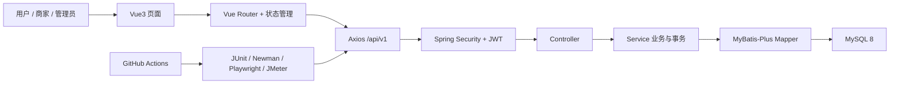

# QueueMate 项目学习总纲与教学方案

> 版本：1.0
> 创建日期：2026-08-16
> 适用对象：希望真正吃透 QueueMate，并把项目可靠地写进简历、用于面试讲解的学习者
> 使用方式：这是后续所有项目学习对话的总入口。新对话必须先完整阅读本文件，再按“当前进度”继续。

## 1. 当前学习进度

这一部分是跨对话的学习接力棒。每完成一课，由老师更新一次；不要提前勾选。

| 项目 | 当前值 |
| --- | --- |
| 当前阶段 | 阶段 A：建立全局地图 |
| 当前模块 | 模块 0：项目全景与学习方法 |
| 下一课 | 0.1 用最直白的话讲清 QueueMate 是什么 |
| 已完成课程 | 0 / 44 |
| 最近学习日期 | 尚未开始 |
| 当前薄弱点 | 尚未诊断 |
| 下次开场 | 先做 3 个基础诊断问题，再开始 0.1 |

### 课程完成状态

- [ ] 模块 0：项目全景与学习方法
- [ ] 模块 1：本地运行、网络与一次请求的完整路径
- [ ] 模块 2：MySQL 数据模型与 SQL 基础
- [ ] 模块 3：Java 与 Spring Boot 分层
- [ ] 模块 4：登录、JWT、Spring Security 与 RBAC
- [ ] 模块 5：核心业务模块与状态机
- [ ] 模块 6：事务、并发与数据一致性
- [ ] 模块 7：Vue3 前端与响应式页面
- [ ] 模块 8：自动化测试体系
- [ ] 模块 9：Git、GitHub Actions 与持续集成
- [ ] 模块 10：性能工程、排障与工程质量
- [ ] 模块 11：简历表达与模拟面试

## 2. 新对话如何开始

以后开启新的学习对话时，直接复制下面这段话：

```text
请先完整阅读 D:\QueueMate\knowledge\00-learning-roadmap-and-teaching-plan.md，
再阅读其中“当前学习进度”指定的相关文件。你是我的 QueueMate 项目老师，
请严格按照文件中的教学协议，从下一课继续，不要跳课，也不要一次讲太多。
```

如果想复习某一课，可以这样说：

```text
请读取 QueueMate 项目学习总纲，今天复习第 6.2 课“预约如何防止超卖”。
先提问检查我还记得多少，再针对薄弱点讲解。
```

## 3. 最终学习目标

“看过代码”不等于“吃透项目”。本课程把掌握程度分成五级：

| 等级 | 能力 | 判断标准 |
| --- | --- | --- |
| L1 会使用 | 能启动、登录和操作功能 | 不看教程也能跑起前后端，知道主要页面在哪 |
| L2 会解释 | 能用自己的话说明概念 | 不背术语，能说明“为什么这样设计” |
| L3 会追踪 | 能沿真实代码走完整链路 | 能从页面按钮追到 Axios、Controller、Service、Mapper 和数据库 |
| L4 会修改 | 能独立完成小改动并验证 | 能判断影响范围，补测试，清理数据，避免破坏原逻辑 |
| L5 会表达 | 能用于简历和面试 | 能在 3 分钟、10 分钟和深挖追问三种场景下讲清楚 |

写进简历前，核心模块 3、4、5、6、8、9 至少达到 L4，整个项目达到 L3。

## 4. 项目全景图

QueueMate 是一个生活场景的预约与排队平台，模拟奶茶店、自习室、羽毛球场等地点。它不是简单的页面展示，而是一个前后端、数据库、权限、并发、测试和 CI 都闭环的工程。



### 4.1 技术栈

| 层次 | 技术 | 在项目中的作用 |
| --- | --- | --- |
| 后端语言 | Java 21 | 编写业务、权限、事务和测试 |
| 后端框架 | Spring Boot 3.3.5 | 启动 Web 服务、组织组件和配置 |
| Web 与校验 | Spring MVC、Jakarta Validation | 接收 HTTP 请求、校验参数、返回 JSON |
| 权限 | Spring Security、JJWT 0.12.6 | 登录、JWT 解析、401/403、角色控制 |
| 数据访问 | MyBatis-Plus 3.5.9 | Entity、Mapper、条件查询和自定义 SQL |
| 数据库 | MySQL 8、InnoDB | 保存业务数据，提供事务、索引和约束 |
| 前端 | Vue 3.5、Vite 7 | 构建响应式单页应用 |
| 前端配套 | Vue Router、Axios、Element Plus | 路由、接口请求和 UI 组件 |
| 后端测试 | JUnit 5、Mockito、Spring Security Test | 服务逻辑、权限边界和接口测试 |
| 接口测试 | Postman、Newman | 45 个请求、99 个断言的可重复回归 |
| UI 测试 | Playwright | 6 条真实浏览器核心业务链路 |
| 性能测试 | JMeter | 12 用户并发预约、防超卖和报告 |
| 持续集成 | GitHub Actions | 云端自动构建、测试和保存报告 |

### 4.2 业务模块

| 模块 | 主要能力 | 代表代码目录 |
| --- | --- | --- |
| 用户与身份 | 注册、登录、多角色、JWT | `backend/.../auth`、`backend/.../user` |
| 商家入驻 | 申请、审核、授予商家角色 | `backend/.../merchant` |
| 地点 | 浏览、创建、修改、启停、归属校验 | `backend/.../venue` |
| 预约时段 | 日期、时间、容量、价格和开放状态 | `backend/.../booking/BookingSlot*` |
| 预约 | 免费/付费预约、取消、退款 | `backend/.../booking/Booking*` |
| 钱包 | 充值、扣款、退款、人工调整、流水 | `backend/.../wallet` |
| 消费码 | 创建、查询、核销、作废、过期 | `backend/.../booking/BookingVoucher*` |
| 排队 | 取号、叫号、完成、过号、公开进度 | `backend/.../queue` |
| 统计 | 按小时聚合预约和排队数据 | `backend/.../stats` |

## 5. 知识框架

整个知识体系按依赖关系学习：

1. **工程基础**：进程、端口、HTTP、JSON、Git、Maven、pnpm。
2. **数据库基础**：表、主键、外键、索引、唯一约束、事务。
3. **后端基础**：Java 对象、Spring 容器、Controller、Service、Mapper。
4. **安全体系**：密码哈希、JWT、过滤器、401/403、RBAC、资源归属。
5. **业务建模**：状态机、预约、钱包、消费码、排队、统计。
6. **一致性与并发**：原子更新、行锁、唯一约束、幂等、事务回滚。
7. **前端体系**：Vue 响应式、组件、路由、Axios、状态、移动端适配。
8. **质量保障**：单元测试、接口测试、UI 测试、性能测试、测试数据清理。
9. **持续集成**：工作流、Runner、服务容器、构建产物、失败日志。
10. **项目表达**：项目亮点、技术取舍、问题复盘、简历和面试。

学习顺序不能完全颠倒。例如，不理解数据库唯一约束和事务，就很难真正理解“并发预约为什么不会超卖”；不理解 HTTP 和 JWT，就很难理解前端登录状态。

## 6. 44 课完整课程路线

建议每课 45–75 分钟，每周学习 4 课，约 11 周完成。不要按日期硬赶，以“能讲、能追、能做”为通过标准。

### 阶段 A：建立全局地图

#### 模块 0：项目全景与学习方法（2 课）

| 课次 | 主题 | 学完必须做到 |
| --- | --- | --- |
| 0.1 | 用最直白的话讲清 QueueMate 是什么 | 90 秒介绍角色、功能和价值 |
| 0.2 | 认识仓库目录和完整架构 | 不看文档画出前端→后端→数据库→测试→CI |

代码入口：`README.md`、`HANDOFF.md`、`frontend/queuemate-web/src/App.vue`、`backend/queuemate-server/src/main/java/com/queuemate/QueueMateApplication.java`。

阶段产物：一张手绘架构图、一段 90 秒口头介绍。

#### 模块 1：本地运行、网络与一次请求的完整路径（3 课）

| 课次 | 主题 | 学完必须做到 |
| --- | --- | --- |
| 1.1 | 进程、端口和 localhost | 解释 5173、8080、3306 分别是谁 |
| 1.2 | HTTP 请求、响应、JSON 和状态码 | 解释 GET/POST/PATCH、200/201/400/401/403/409/500 |
| 1.3 | 从“登录”按钮追一次完整请求 | 从 Vue 表单追到数据库查询，再追响应返回页面 |

代码入口：`frontend/.../services/http.js`、`frontend/.../services/api.js`、`AuthController.java`、`AuthService.java`、`application.yml`。

配套教材：`knowledge/01-project-initialization-and-runtime.md`。

#### 模块 2：MySQL 数据模型与 SQL 基础（3 课）

| 课次 | 主题 | 学完必须做到 |
| --- | --- | --- |
| 2.1 | 表、行、列、主键、外键 | 说明 11 张表分别保存什么，主要关系是什么 |
| 2.2 | 索引、唯一约束、检查约束 | 用项目案例说明“代码校验为什么不能替代数据库约束” |
| 2.3 | InnoDB、事务和 DECIMAL | 解释金额为什么不用浮点数，事务为什么能回滚 |

代码入口：`sql/schema.sql`、`sql/data.sql`。

阶段练习：从一个预约 ID 手工关联到用户、地点、时段、钱包流水和消费码。

### 阶段 B：吃透后端与安全

#### 模块 3：Java 与 Spring Boot 分层（4 课）

| 课次 | 主题 | 学完必须做到 |
| --- | --- | --- |
| 3.1 | Java 类、对象、接口、枚举和 record | 能识别 Entity、Request、Response、Mapper、Enum |
| 3.2 | Spring Bean 与依赖注入 | 解释为什么 Service 不自己 `new Mapper()` |
| 3.3 | Controller、Service、Mapper 分层 | 追踪地点查询，说明每层该做什么、不该做什么 |
| 3.4 | 参数校验、统一响应和异常处理 | 解释 `@Valid`、`BusinessException`、`GlobalExceptionHandler` |

代码入口：`VenueController.java`、`VenueService.java`、`VenueMapper.java`、`ApiResponse.java`、`GlobalExceptionHandler.java`。

通过标准：给出一个新需求时，能判断代码应放在哪一层。

#### 模块 4：登录、JWT、Spring Security 与 RBAC（4 课）

| 课次 | 主题 | 学完必须做到 |
| --- | --- | --- |
| 4.1 | 注册、密码哈希与登录 | 解释为什么不能存明文密码，注册为何同时创建钱包 |
| 4.2 | JWT 的结构、签名、过期与局限 | 不把 JWT 说成“加密用户数据” |
| 4.3 | Security 过滤器链和登录态 | 追踪请求如何从 Authorization 头变成当前用户 |
| 4.4 | RBAC、401/403 与资源归属 | 区分“有没有角色”和“是不是这个地点的所有者” |

代码入口：`AuthService.java`、`JwtTokenService.java`、`JwtAuthenticationFilter.java`、`SecurityConfig.java`、`AuthenticatedUser.java`、`VenueService.requireOwnerOrAdmin`。

配套教材：`knowledge/02-authentication-and-jwt.md`、`knowledge/03-venue-management-and-rbac.md`。

高频面试题：JWT 有什么缺点？401 和 403 有何区别？只在前端隐藏按钮为什么不安全？

### 阶段 C：吃透业务、事务与并发

#### 模块 5：核心业务模块与状态机（5 课）

| 课次 | 主题 | 主要状态或链路 |
| --- | --- | --- |
| 5.1 | 商家入驻与多角色账号 | PENDING → APPROVED / REJECTED |
| 5.2 | 地点与预约时段 | 地点归属、OPEN/CLOSED、容量和价格 |
| 5.3 | 免费预约与取消 | BOOKED → CANCELLED，容量释放 |
| 5.4 | 付费预约、钱包和消费码 | 扣款→预约→凭证；取消→退款→作废 |
| 5.5 | 排队与繁忙统计 | WAITING → CALLED → COMPLETED/MISSED |

代码入口：`merchant`、`venue`、`booking`、`wallet`、`queue`、`stats` 六个包。

配套教材：`knowledge/04-booking-slots.md` 至 `knowledge/08-backend-completion.md`。

阶段产物：画出预约状态机、消费码状态机、排队状态机，指出每次非法转换返回什么。

#### 模块 6：事务、并发与数据一致性（4 课）

| 课次 | 主题 | 项目中的真实例子 |
| --- | --- | --- |
| 6.1 | `@Transactional` 与回滚边界 | 付费预约任一步失败都不能留下半套数据 |
| 6.2 | 原子 SQL 防预约超卖 | `reserved_count < capacity` 条件更新 |
| 6.3 | 行锁、余额原子扣减与幂等 | `SELECT ... FOR UPDATE`、余额条件、业务唯一键 |
| 6.4 | 并发取号与状态条件更新 | 每日序列表、唯一约束、expected→target 更新 |

关键代码：

- `BookingService.create` 与 `BookingSlotMapper.reserveCapacity`
- `WalletService.chargeBooking` 与 `WalletMapper.selectByUserIdForUpdate`
- `QueueTicketService.take` 与 `QueueSequenceMapper.next`
- `BookingVoucherService` 的核销、退款和过期处理
- `sql/schema.sql` 中生成列和唯一约束

必须能回答：

1. 为什么先查询剩余名额再 `reserved_count + 1` 会超卖？
2. 为什么“先在代码中检查重复”仍然需要唯一约束？
3. 为什么钱包流水需要 `biz_type + biz_no + type` 唯一键？
4. 如果扣款成功但预约写入失败，事务应该发生什么？

### 阶段 D：吃透 Vue3 前端

#### 模块 7：Vue3 前端与响应式页面（4 课）

| 课次 | 主题 | 学完必须做到 |
| --- | --- | --- |
| 7.1 | Vue 单文件组件、模板、响应式状态 | 解释 `ref`、`reactive`、`computed`、事件绑定 |
| 7.2 | Router、路由守卫和多角色导航 | 解释登录跳转、角色首页和页面保护 |
| 7.3 | Axios、统一错误处理和前后端联调 | 追踪 token 注入、401 清理会话、API 数据渲染 |
| 7.4 | 组件复用、设计 token 与移动端适配 | 解释 AppShell、StatePanel、VenueCard、StickerBadge |

代码入口：

- `src/main.js`、`src/App.vue`
- `src/router/index.js`
- `src/state/auth.js`
- `src/services/http.js`、`src/services/api.js`
- `src/components`、`src/styles`
- `design-system/MASTER.md`

配套教材：`knowledge/09-vue3-frontend-design-system.md`、`knowledge/10-vue3-full-role-frontend.md`。

阶段练习：任选“地点列表”或“钱包”页面，从页面加载一直追到接口返回，再说明 loading、empty、error、success 四种状态。

### 阶段 E：吃透测试工程

#### 模块 8：自动化测试体系（5 课）

| 课次 | 主题 | 项目资产 |
| --- | --- | --- |
| 8.1 | 测试金字塔、断言和测试隔离 | 后端 144 个测试的分层与职责 |
| 8.2 | JUnit、Mockito 与 Security Test | Service 单测、Controller 权限测试 |
| 8.3 | Postman/Newman 接口回归 | 45 请求、99 断言、环境变量、清理端点 |
| 8.4 | Playwright 真实浏览器 E2E | 6 条核心链路、fixture、trace、截图和视频 |
| 8.5 | JMeter 并发性能测试 | 12 并发、同步定时器、JTL、P90/P95、中文报告 |

代码入口：`backend/.../src/test`、`tests/postman`、`tests/playwright`、`tests/jmeter`。

配套教材：`knowledge/11-postman-newman-repeatable-regression.md` 以及各测试目录的 `README.md`。

必须能回答：

- 单元测试、接口测试、UI 测试和性能测试各自能发现什么问题？
- 为什么测试数据必须带唯一运行标记并在 finally/tearDown 中清理？
- JMeter 进程返回 0，为什么仍要检查 JTL 中的失败采样？
- 为什么 E2E 清理接口只能在专用 profile 下开启？

### 阶段 F：吃透工程化与排障

#### 模块 9：Git、GitHub Actions 与持续集成（3 课）

| 课次 | 主题 | 学完必须做到 |
| --- | --- | --- |
| 9.1 | Git 工作区、暂存区、提交和远程 | 看懂 `status`、`diff`、`log`、`push`，保护他人改动 |
| 9.2 | GitHub Actions 工作流 | 解释 trigger、job、step、Runner、service、artifact |
| 9.3 | 用真实失败学习 CI 排障 | 复盘 pnpm 9/11 和 JMeter 报告目录问题 |

代码入口：`.github/workflows/ci.yml`、`.github/workflows/full-regression.yml`。

真实证据：基础构建运行 `31955863006`，全量回归运行 `31955575452`。

#### 模块 10：性能工程、排障与工程质量（3 课）

| 课次 | 主题 | 学完必须做到 |
| --- | --- | --- |
| 10.1 | 性能指标和瓶颈定位 | 区分吞吐量、平均值、P90/P95、错误率和资源指标 |
| 10.2 | 系统化排障 | 按页面→网络→后端日志→SQL→环境逐层缩小范围 |
| 10.3 | 安全、可维护性和当前边界 | 能诚实说明项目没有 Refresh Token、限流、重叠时段等能力 |

阶段练习：针对“登录后页面跳回登录”“预约偶发失败”“CI 本地通过远程失败”各写一棵排障树。

### 阶段 G：把技术变成简历和面试能力

#### 模块 11：简历表达与模拟面试（4 课）

| 课次 | 主题 | 产物 |
| --- | --- | --- |
| 11.1 | 项目 30 秒、90 秒、3 分钟介绍 | 三个版本的口头稿 |
| 11.2 | 简历项目描述与量化结果 | 一版不过度包装的简历项目经历 |
| 11.3 | 高频技术追问与压力追问 | 至少 30 个问题的口头回答 |
| 11.4 | 完整模拟面试与查漏补缺 | 一次 30–45 分钟模拟面试记录 |

简历中可量化但必须能解释的真实数据：

- 144 个后端自动化测试
- Newman 45 个请求、99 个断言
- Playwright 6 条核心业务链路
- JMeter 12 用户并发、容量 3、3 成功/9 已满、56 采样零错误
- 两层 GitHub Actions，最终基础构建与全量回归成功

## 7. 老师必须遵守的教学协议

后续任何新对话中的老师都必须遵守以下规则。

### 7.1 开课前

1. 完整阅读本文件的“当前学习进度”。
2. 阅读本课列出的真实代码和配套知识记录，不凭印象讲项目。
3. 如果是第一次上课，先问 3 个诊断问题，判断 Java、数据库、前端基础，但不能因此跳过项目总览。
4. 明确告诉学生今天只解决什么问题，以及学完如何判断自己真的会了。

### 7.2 每课固定结构

每节课按下面顺序进行：

1. **回忆**：用 2–3 个问题复习上一课。
2. **直白解释**：先用生活类比说明“它解决什么问题”，再给术语。
3. **代码追踪**：只使用 QueueMate 真实文件，画出调用顺序。
4. **学生复述**：要求学生用自己的话讲一遍，老师纠正但不替学生背答案。
5. **小练习**：至少一个读代码、画流程、预测结果或安全小改动。
6. **面试连接**：给出一个面试问法，让学生先答，再优化表达。
7. **下课验收**：3 道口头题 + 1 个实践题，达到 80% 才勾选完成。

### 7.3 讲解风格

- 默认学生是初学者，第一次出现的术语必须解释。
- 一次最多引入 3 个新核心概念。
- 先说“为什么”，再说“是什么”，最后说“代码怎么做”。
- 优先用 QueueMate 的登录、预约、钱包、排队场景举例。
- 不让学生死背代码；重点是调用链、约束、状态和设计取舍。
- 学生答错时，指出具体哪一步推理错了，不只给正确答案。
- 不用“这个很简单”“显然”等会制造压力的说法。
- 未经学生要求，不在教学课中顺手大改业务代码。

### 7.4 每课结束后的记录格式

老师在对话末尾给出：

```text
本课：
已掌握：
还不稳：
实践结果：
面试表达评分（10 分）：
下一课：
课后任务：
```

同时更新本文件第 1 节的当前进度。每完成一个模块，再提交一次学习进度文档，避免每节课产生过多 Git 提交。

## 8. 每个模块的验收标准

每个模块按四项各 0–2 分评分，总分至少 6 分才能进入下一模块：

| 维度 | 0 分 | 1 分 | 2 分 |
| --- | --- | --- | --- |
| 概念理解 | 说不清用途 | 能复述定义 | 能用项目例子解释为什么 |
| 代码追踪 | 找不到入口 | 提示后能追 | 能独立画出调用链 |
| 实践能力 | 无法操作 | 能照步骤完成 | 能独立验证并解释结果 |
| 面试表达 | 只报术语 | 能讲过程 | 有背景、方案、取舍、结果和边界 |

如果未通过，不是把整章重学，而是针对最低分维度补一课。

## 9. 简历就绪检查表

全部勾选后，才建议把项目作为重点项目写进简历：

- [ ] 我能在 90 秒内讲清项目背景、角色、核心功能和技术栈。
- [ ] 我能不看代码画出前端、后端、数据库和测试架构。
- [ ] 我能追踪一次登录和一次付费预约的完整调用链。
- [ ] 我能解释 JWT、401/403、RBAC 和资源归属校验。
- [ ] 我能解释事务回滚、原子 SQL、行锁、唯一约束和幂等。
- [ ] 我能画出预约、消费码和排队状态机。
- [ ] 我能解释 Vue Router、Axios 拦截器和登录状态保存。
- [ ] 我能说明四层测试各自的价值，而不是只会报工具名。
- [ ] 我能解释 GitHub Actions 两条流水线和两次真实故障修复。
- [ ] 我能诚实说明项目边界和下一步优化，不把模拟能力说成生产能力。
- [ ] 我能现场完成一个小需求的影响分析、代码修改和测试设计。
- [ ] 我完成过一次 30 分钟以上的项目模拟面试。

## 10. 第一课教学方案

### 第 0.1 课：用最直白的话讲清 QueueMate 是什么

时间：约 60 分钟。

目标：

1. 说清项目解决什么问题。
2. 说清 USER、MERCHANT、ADMIN 三类角色。
3. 说清预约和排队是两条不同业务链。
4. 用 90 秒完成第一次项目介绍，不要求使用复杂术语。

开场诊断问题：

1. 你目前能不能用自己的话解释“前端、后端、数据库”分别是什么？
2. 你更熟悉 Java、数据库、前端还是测试中的哪一个？
3. 如果面试官现在问“这个项目是做什么的”，你会怎么回答？

课堂流程：

1. 浏览 README 的项目简介和功能清单。
2. 亲自操作一次“浏览地点→预约”和“取号→叫号”的页面路径。
3. 对照三类角色列出“谁能看、谁能改、谁能审核”。
4. 老师画出最简系统图，学生用自己的话复述。
5. 学生完成第一版 90 秒介绍，老师只优化结构，不替学生写成背稿。

下课验收：

- 不看文档说出三个角色。
- 解释预约和排队的区别。
- 解释这个项目为什么不只是 CRUD。
- 完成 90 秒口头介绍。

课后任务：手写一张角色—功能表，并录一次 90 秒项目介绍，自己找出最不顺的三句话。

## 11. 高频项目面试问题索引

这些问题不要求一开始就回答，课程会逐步覆盖。

1. QueueMate 的整体架构是什么？
2. 为什么选择前后端分离？
3. Controller、Service、Mapper 怎么分工？
4. 为什么使用 DTO，而不是直接让 Entity 接收请求？
5. JWT 的签名和加密有什么区别？
6. 401 和 403 的区别是什么？
7. 如何防止商家修改别人的地点？
8. 如何防止同一用户重复预约同一时段？
9. 12 个用户抢 3 个名额，如何保证不会超卖？
10. 付费预约为什么必须使用事务？
11. 钱包为什么既保存余额又保存流水？
12. 如何防止重复扣款和重复退款？
13. 消费码核销和退款同时发生怎么办？
14. 排队号码如何保证同一地点同一天连续且不重复？
15. 为什么状态更新要带 expected status 条件？
16. MySQL 唯一约束和代码预检查为什么都要有？
17. Vue 登录状态存在哪里？有什么风险？
18. Axios 拦截器在项目中做了什么？
19. 路由守卫能不能代替后端权限校验？
20. 单元测试、接口测试、E2E 和性能测试的区别是什么？
21. Postman 集合如何做到重复运行不污染数据？
22. Playwright 为什么需要独立浏览器上下文？
23. JMeter 中 P90/P95 和平均响应时间分别说明什么？
24. GitHub Actions 如何启动临时 MySQL 和后端？
25. 为什么本地通过，GitHub Actions 可能失败？
26. 这个项目遇到过最有价值的两个故障是什么？
27. 如果流量扩大 100 倍，最先改什么？
28. 当前项目有哪些安全边界和生产化缺口？
29. 如果让你重做一次，哪些设计会保留，哪些会调整？
30. 你本人具体完成和理解了哪些部分？

## 12. 现有教材索引

总纲负责学习顺序，下面的文件负责具体内容：

1. `01-project-initialization-and-runtime.md`：项目初始化、本地运行、Maven、Spring Boot、MySQL。
2. `02-authentication-and-jwt.md`：注册、登录、密码、JWT、Security。
3. `03-venue-management-and-rbac.md`：地点管理、角色和资源归属。
4. `04-booking-slots.md`：固定预约时段。
5. `05-booking-concurrency.md`：免费预约与防超卖。
6. `06-paid-booking-consumption-voucher-design.md`：付费预约和消费码设计。
7. `07-wallet-voucher-implementation.md`：钱包、扣款、退款和核销实现。
8. `08-backend-completion.md`：排队、管理员调整和繁忙统计。
9. `09-vue3-frontend-design-system.md`：Vue3 前端和设计系统。
10. `10-vue3-full-role-frontend.md`：全角色前端业务闭环。
11. `11-postman-newman-repeatable-regression.md`：Postman/Newman 可重复回归。

当教材与当前代码不一致时，以当前代码、`README.md`、`HANDOFF.md` 和最新测试结果为准，并在课堂中指出差异。

## 13. 学习边界

本课程的目标不是让你背下每行代码，也不是假装项目已经达到大型生产系统标准。

应该做到：

- 能解释当前设计为何成立。
- 能指出它在当前规模下解决了什么问题。
- 能说出没有解决的问题和合理的下一步。
- 能通过真实代码、测试和 CI 证据支持自己的简历表达。

不应该做：

- 不理解就直接背简历话术。
- 把模拟充值说成真实支付接入。
- 把本地 JWT 方案说成完整生产安全体系。
- 只报“用了 Spring Boot、Vue、JMeter”，却讲不出调用链和设计取舍。
- 为了显得高级而虚构微服务、Redis、消息队列或云部署。

完成这份路线后，你应该能诚实而有底气地说：这个项目不只是“我运行过”，而是“我能解释、能修改、能测试，也能复盘它为什么这样设计”。
